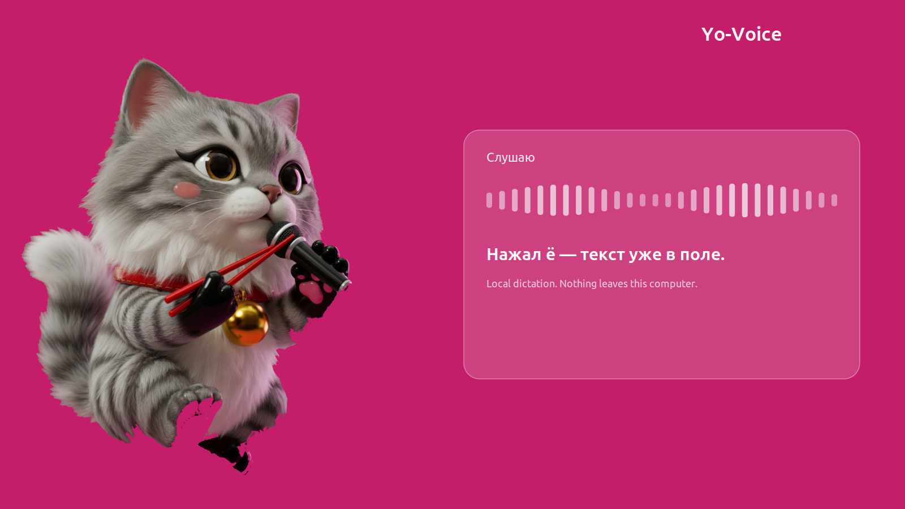

# Yo-Voice

[](CHANGELOG.md)



**Yo-Voice** (Ёхо) is local push-to-talk dictation for Linux. Press the hotkey, speak, pause — the transcript is pasted into whatever text field has focus.

It is not a cloud product. Microphone audio and transcripts stay on the computer that runs it.

## What it does

- Types what you say into the **currently focused** text field (browser, editor, chat, terminal).
- Runs **on your machine**. Speech is recognized locally with `faster-whisper` (`large-v3-turbo`). Nothing is uploaded to a speech API.
- Speaks **Russian**. Punctuation and capitalization are cleaned up after recognition.
- Shows a small **cat overlay** while listening: **Жду** (waiting / loading), **Можно говорить** (about one second after the mic is live), then **Слушаю** (listening). The waveform moves only while the microphone is actually capturing.
- Lets you pick the microphone by **right-clicking the cat**.
- Starts a background daemon at login, so the hotkey is ready without opening a window.

## What it cannot do

Yo-Voice 1.0.0 does **not**:

- Run on **Windows** or **macOS**
- Run on a **Wayland-only** session (it needs **X11** for the global hotkey and paste)
- Send audio or text to the cloud, or offer an account / sync
- Stream words into the cursor **while you are still talking** (it pastes after a pause, or when you press the hotkey again)
- Keep a history of recordings or WAV files
- Switch languages (recognition is locked to Russian)
- Replace a full accessibility on-screen keyboard or a system-wide IME

Developed and tested on **Linux Mint 22.3, Cinnamon, X11**. Other X11 desktops may work; they are not the supported target.

## Privacy

- **Your speech never leaves this computer.** Recognition runs locally.
- **Transcripts are not uploaded.** They are pasted into the focused app through the clipboard, then the previous clipboard contents are restored.
- Config lives in `~/.config/yo-voice/`. Logs and the daemon socket live in `~/.cache/yo-voice/`.
- The only expected network use is **install time** (Python packages) and the **first launch**, which downloads Whisper model weights (~1.6 GB) into a local cache. That download is model files, not your microphone.

## Hotkey

Dictation is bound to the key **immediately left of `1`**:

| Keyboard layout | Key |
|---|---|
| Russian (ЙЦУКЕН) | **ё** |
| US / UK | **\`** (grave / tilde key, unshifted) |

X11 keycode **49**. Holding **Shift+ё** still types **Ё** — only the unshifted key is grabbed.

If another app already owns that key, the overlay says `клавиша ё занята`.

## Requirements

- Linux with an **X11** session (Cinnamon on Linux Mint 22.3 is the reference)
- Python **3.10+**
- A working **microphone**
- **NVIDIA GPU strongly recommended** (tested on RTX 4070 Ti). CPU fallback exists and is slow.
- Disk: a few hundred MB for the app, plus **~1.6 GB** for the Whisper model on first run

## Install on Linux

### 1. System packages

```bash
sudo apt update
sudo apt install -y \
  git curl \
  python3 python3-venv python3-pip \
  python3-gi python3-gi-cairo python3-cairo python3-xlib \
  gir1.2-gtk-3.0 libportaudio2
```

Install your NVIDIA driver from Driver Manager if you want GPU recognition.

### 2. Download

```bash
git clone https://github.com/iammedved/Yo-Voice.git
cd Yo-Voice
```

### 3. Install

```bash
chmod +x scripts/install.sh
./scripts/install.sh
```

The installer:

1. Creates `.venv` (with system GTK / X11 bindings)
2. Installs Python dependencies, including CUDA libraries when available
3. Puts a **Ёхо** launcher on the Desktop and in the application menu
4. Enables **autostart** of the background daemon (`~/.config/autostart/yo-voice.desktop`, 3 second delay)
5. Symlinks `yo-voice` into `~/.local/bin/`

### 4. First launch

1. If the Desktop icon asks for permission, choose **Allow Launching**.
2. Click **Ёхо**, or run `yo-voice` (add `~/.local/bin` to `PATH` if needed).
3. Press **ё** / **\`**. The cat appears. The **first** time, it downloads the model and the overlay may show a loading status for a minute.
4. Speak Russian. When you pause, text is pasted at the caret. Press the hotkey again to stop.

Right-click the cat to choose the microphone (**Авто** = automatic).

### Later launches (every day after that)

You do **not** need to open the app by hand.

- After you log into Cinnamon, the **daemon starts by itself**.
- Press **ё** / **\`** to start or stop listening.
- The Desktop / menu icon toggles listening the same way.
- First-run model download happens only once; later starts are local and fast on GPU.

Useful commands:

```bash
yo-voice              # toggle listening (starts the daemon if needed)
yo-voice daemon       # run the background daemon in this terminal
yo-voice status       # idle | listening
yo-voice start        # start listening
yo-voice stop         # stop and paste
yo-voice settings     # microphone window
yo-voice quit         # stop the daemon
yo-voice demo         # overlay demo without dictation
```

Re-run `./scripts/install.sh` after a `git pull` to refresh the venv and launchers.

## How a dictation pass works

1. Hotkey (or the launcher) tells the daemon to listen.
2. Overlay appears without stealing keyboard focus, so the caret stays in your app.
3. Silero VAD keeps silence out of Whisper; only speech is transcribed.
4. On a pause, the utterance is recognized locally and pasted with Ctrl+V (Ctrl+Shift+V in terminals).
5. Press the hotkey again to flush the last bit and hide the cat.

## Troubleshooting

| Symptom | What to try |
|---|---|
| Waves do not move | Unmute the headset mic. Right-click the cat and pick the real device, not a monitor/loopback. |
| `подключите микрофон` | No usable capture device. Plug in a mic and pick it in the menu. |
| `клавиша ё занята` | Another program grabbed keycode 49. Close it or change that grab. |
| Icon does nothing | Desktop files on Mint often need **Allow Launching**. Or run `yo-voice` in a terminal. |
| First start is slow | Model download / GPU load. Later starts should not download again. |
| GPU unused | NVIDIA driver + the `nvidia-cublas-cu12` / `nvidia-cudnn-cu12` wheels from `install.sh`. CPU still works, slowly. |
| Nothing pastes | Click the target field first. The overlay never takes focus on purpose. |

## Versioning

This tree is **1.0.0**. See [CHANGELOG.md](CHANGELOG.md). Git tags follow semver (`v1.0.0`).

## License

[MIT](LICENSE). Third-party models (`faster-whisper` / Whisper weights, Silero VAD) keep their own licenses.
